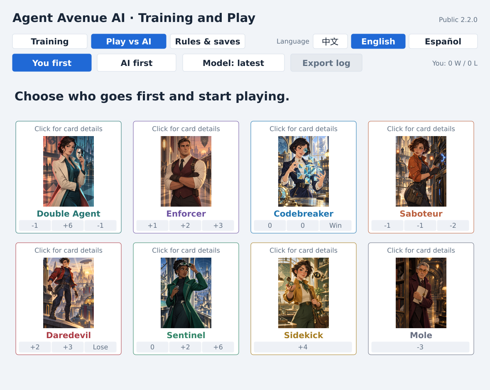
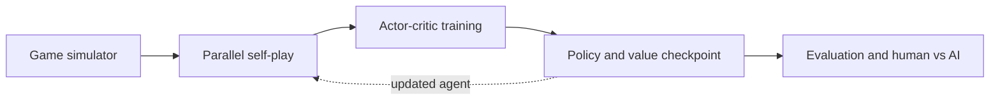
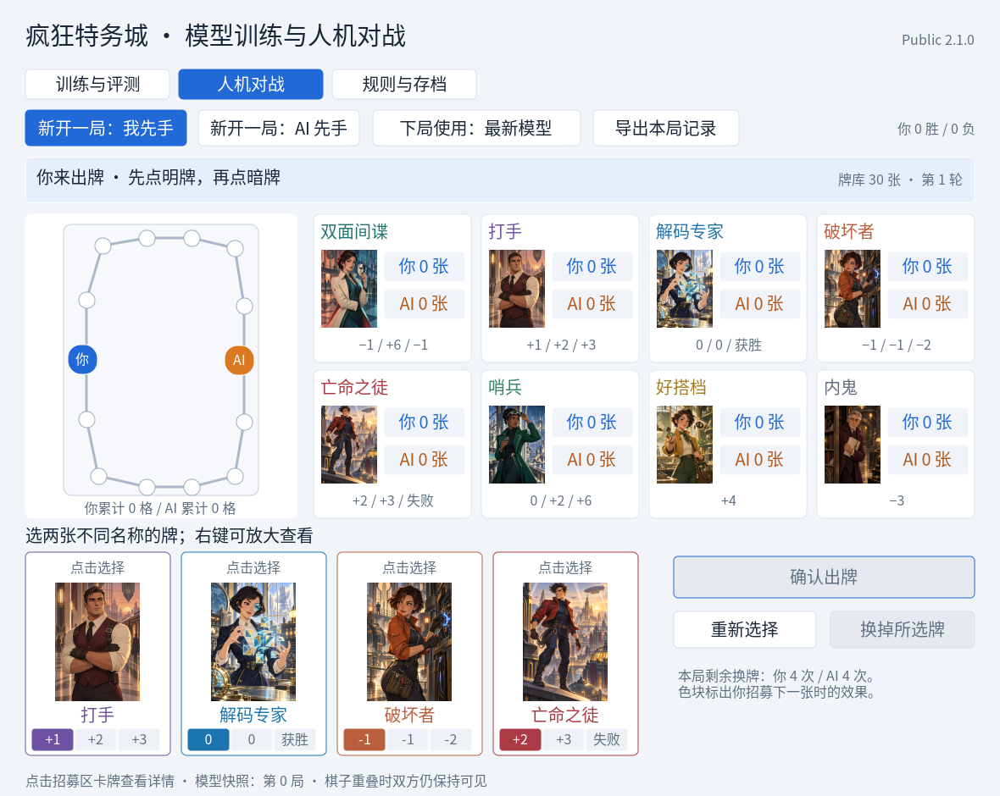

# Agent Avenue AI

[](https://github.com/HongyuLeo/agent-avenue-ai-lab/actions/workflows/ci.yml)
[](https://github.com/HongyuLeo/agent-avenue-ai-lab/releases/latest)
[](https://isocpp.org/)
[](src/cuda_backend.hpp)
[](LICENSE)

**17.3M self-play games · 85.28% vs random · Playable Windows AI opponent**

An unofficial, open-source **self-play reinforcement-learning system for the hidden-information board game _Agent Avenue_**. The repository covers the complete engineering loop: a C++17 game simulator, parallel self-play, actor-critic training, optional CUDA updates, reproducible evaluation, checkpoint-safe resume, and a multilingual human-vs-AI desktop application.

[**Download the latest Windows release →**](https://github.com/HongyuLeo/agent-avenue-ai-lab/releases/latest) · [See the demo](#play-the-trained-agent) · [Read the evaluation](docs/EVALUATION.md) · [中文说明](README.zh-CN.md)



[Highlights](#highlights) · [Results](#trained-checkpoint) · [Architecture](#architecture-at-a-glance) · [Play](#play-the-trained-agent) · [Build](#build-from-source) · [My role](#authorship-and-ai-disclosure)

## Highlights

- **Game environment:** complete two-player hidden-information simulator with legal-action masking and observation privacy tests.
- **Learning system:** compact actor-critic network with 128 inputs, one 48-unit `tanh` layer, 74 policy outputs, one value output, and 9,867 trainable parameters.
- **Self-play pipeline:** deterministic parallel CPU rollout collection with optional CUDA/NVRTC gradient updates.
- **Reliable long runs:** atomic checkpoints, checksums, `.bak` recovery, and exact resume of model, optimizer, RNG, counters, and partial batches.
- **Evaluation:** frozen-model matches against random, handwritten heuristic, and saved champion opponents, balanced across first and second player.
- **Playable product:** native Windows human-vs-AI interface with outcome explanations, card inspection, first-player switching, and Chinese, English, and Spanish localization.
- **Test coverage:** regression tests for rules, information isolation, serialization, corruption recovery, gradients, parallel training, and UI transitions.

## Trained checkpoint

The public checkpoint contains **17,366,354 self-play games** and **1,085,397 optimizer updates**. Each result below comes from 5,000 frozen-model games, balanced across first and second player.

| Opponent | Wins | Win rate |
|---|---:|---:|
| Uniform random | 4,264 / 5,000 | **85.28%** |
| Handwritten heuristic | 3,988 / 5,000 | **79.76%** |
| Saved champion snapshot | 2,652 / 5,000 | **53.04%** |

The champion comparison measures progress against an earlier saved policy; it is not a claim of expert or solved play. See [the evaluation protocol and limitations](docs/EVALUATION.md).

## Architecture at a glance



Training, evaluation, automated tests, and the Windows application all use the same `Game` state machine, so rule fixes do not diverge between modes. CPU self-play produces rollout batches; the update step can run on CPU or through the optional CUDA backend; atomic checkpoints feed both evaluation and the playable client.

For observation/action spaces, file-level responsibilities, and checkpoint guarantees, see [docs/ARCHITECTURE.md](docs/ARCHITECTURE.md).

## Play the trained agent

1. Open the [latest release](https://github.com/HongyuLeo/agent-avenue-ai-lab/releases/latest).
2. Download `AgentAvenueAI-Public-v2.2.1-Windows.zip`.
3. Extract the complete archive and run `AgentAvenueAI.exe`.
4. Select **Play vs AI**. The bundled 17M-game checkpoint is imported automatically on first launch.



The application starts in Simplified Chinese. Use the always-visible **中文 / English / Español** selector to switch the complete interface; the choice is remembered across launches. The writable checkpoint is stored at:

```text
%LOCALAPPDATA%\AgentAvenueAI\training.bin
```

Windows may show a SmartScreen warning because the community binary is not code-signed. You can build from source if preferred.

## Build from source

Requirements: CMake 3.20+, a C++17 compiler, and Windows for the desktop application. With Visual Studio 2022 installed, run:

```powershell
powershell -ExecutionPolicy Bypass -File .\scripts\build-windows.ps1
```

The output is `build\Release\agent_avenue_ai_lab.exe`. CMake copies the frozen public checkpoint from `models/pretrained-17m.bin` beside the executable as `training.bin`.

To build and run the portable tests on Linux or macOS:

```bash
cmake -S . -B build -DCMAKE_BUILD_TYPE=Release
cmake --build build --parallel
ctest --test-dir build --output-on-failure
```

## Repository map

| Area | Where to look |
|---|---|
| Rules, observations, network, serialization | [`src/core.hpp`](src/core.hpp) |
| Parallel rollout collection and updates | [`src/fast_train.hpp`](src/fast_train.hpp) |
| Optional CUDA/NVRTC backend | [`src/cuda_backend.hpp`](src/cuda_backend.hpp) |
| Native Windows training and play UI | [`src/windows.cpp`](src/windows.cpp) |
| Evaluation protocol and limitations | [`docs/EVALUATION.md`](docs/EVALUATION.md) |
| Detailed architecture | [`docs/ARCHITECTURE.md`](docs/ARCHITECTURE.md) |
| Project ownership and AI disclosure | [`PROJECT_ROLE.md`](PROJECT_ROLE.md) |

## Scope

This repository implements only the standard two-player base mode. It does not implement team play, Black Market, or other expansions. Rule interpretations and known limitations are documented in the source and tests.

## Authorship and AI disclosure

**Liu Hongyu** led the project direction, rules analysis, training operation, defect discovery, evaluation design, visual direction, and public release. AI tools assisted with implementation, refactoring, test scaffolding, documentation, and generation of the project's original card illustrations under his direction and review.

See [PROJECT_ROLE.md](PROJECT_ROLE.md) for a precise contribution breakdown, engineering evidence, and portfolio-ready wording.

## Legal notice

This is an independent, unofficial research and fan-engineering project. _Agent Avenue_, its trademarks, rules, and official artwork belong to their respective owners. The repository contains no official card scans or commercial artwork and is not endorsed by the publisher or designers.

Original source code is available under the [MIT License](LICENSE). Contributions are welcome; please read [CONTRIBUTING.md](CONTRIBUTING.md).
