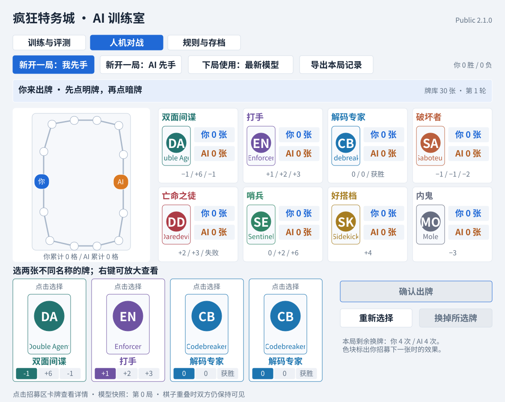

# 疯狂特务城 AI 训练室（公开版）

[English](README.md) · [模型评测](docs/EVALUATION.md) · [架构说明](docs/ARCHITECTURE.md) · [项目分工](PROJECT_ROLE.md)

这是一个非官方的 C++17 自对弈强化学习项目，针对《疯狂特务城》（*Agent Avenue*）标准双人基础玩法。Windows 程序支持继续训练、退出自动保存、模型评测，以及直接与已经训练好的 AI 对战。



## 主要功能

- 隐藏信息对局模拟器和合法行动遮罩；
- 128 输入、48 个 `tanh` 隐藏单元、74 个策略输出和 1 个价值输出，共 9,867 个可训练参数；
- CPU 多线程并行自对弈，可选 CUDA 梯度计算后端；
- 存档校验、原子写入、`.bak` 备份恢复，以及模型、优化器、随机数和未完成批次的精确续训；
- 可视化人机对战、卡牌说明、公开信息和胜负原因；
- 所有卡面和棋盘均为程序原创绘制，不包含商业游戏的官方插画；
- 覆盖规则结算、隐藏信息、存档、数值梯度、界面状态和“第 3 张亡命之徒”问题的自动测试。

## 当前模型

公开存档已完成 **17,366,354 局自对弈**、**1,085,397 次参数更新**。冻结模型后，每个对手测试 5,000 局，并均衡先后手，结果如下：

| 对手 | 获胜局数 | 胜率 |
|---|---:|---:|
| 随机策略 | 4,264 / 5,000 | 85.28% |
| 手写启发式策略 | 3,988 / 5,000 | 79.76% |
| 已保存冠军快照 | 2,652 / 5,000 | 53.04% |

详细方法和限制见 [docs/EVALUATION.md](docs/EVALUATION.md)。

## 普通玩家如何使用

1. 进入本仓库的 **Releases** 页面；
2. 下载 `AgentAvenueAI-Public-v2.1.0-Windows.zip`；
3. 解压整个压缩包，双击 `AgentAvenueAI.exe`；
4. 点击“人机对战”。首次启动会自动导入压缩包内的预训练模型。

以后程序会把可写存档保存在：

```text
%LOCALAPPDATA%\AgentAvenueAI\training.bin
```

因为社区发布的 EXE 没有购买代码签名证书，Windows 可能显示 SmartScreen 提示。介意时可以自行从源码构建。

## 从源码构建

Windows 安装 Visual Studio 2022 的“使用 C++ 的桌面开发”和 CMake 后，在 PowerShell 执行：

```powershell
powershell -ExecutionPolicy Bypass -File .\scripts\build-windows.ps1
```

生成文件为 `build\Release\agent_avenue_ai_lab.exe`。源码仓库不包含训练存档；如果没有把 `training.bin` 放在 EXE 旁边，程序会从随机模型开始。

Linux/macOS 可以构建并运行规则与核心测试：

```bash
cmake -S . -B build -DCMAKE_BUILD_TYPE=Release
cmake --build build --parallel
ctest --test-dir build --output-on-failure
```

## 项目范围

目前只支持标准双人基础玩法，不包含组队、黑市或其他扩展。

## 项目归属与 AI 使用说明

**Liu Hongyu（刘宏宇）**负责项目方向、规则分析、训练运行、缺陷发现、评测决策和发布。AI 编程工具在其指导和审查下辅助了代码实现、重构、测试脚手架与文档。详细说明见 [PROJECT_ROLE.md](PROJECT_ROLE.md)。

## 法律说明

本项目是独立、非官方的研究与爱好者工程项目，不受游戏出版方或设计者背书。《疯狂特务城》/ *Agent Avenue* 的商标、规则和官方美术归相应权利人所有；本仓库不包含官方卡牌扫描图或商业插画。

原创源代码采用 [MIT License](LICENSE)。
