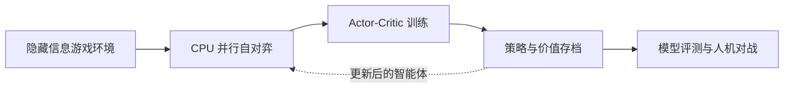

# Agent Avenue AI / 疯狂特务城 AI

[](https://github.com/HongyuLeo/agent-avenue-ai-lab/actions/workflows/ci.yml)
[](https://github.com/HongyuLeo/agent-avenue-ai-lab/releases/latest)
[](https://isocpp.org/)
[](src/cuda_backend.hpp)
[](LICENSE)

**1736 万局自对弈 · 对随机策略胜率 85.28% · 可直接下载的 Windows 人机对战程序**

这是一个面向隐藏信息桌游《疯狂特务城》（_Agent Avenue_）标准双人玩法的开源自对弈强化学习系统。项目覆盖完整工程链路：C++17 游戏环境、CPU 并行 self-play、Actor-Critic、可选 CUDA 更新、可复现评测、可靠断点续训，以及中英西三语 Windows 人机对战程序。

[**下载最新版 Windows 程序 →**](https://github.com/HongyuLeo/agent-avenue-ai-lab/releases/latest) · [查看演示](#与训练好的-ai-对战) · [查看评测方法](docs/EVALUATION.md) · [English](README.md)


## 项目亮点

- **游戏环境：** 完整的双人隐藏信息模拟器、合法行动遮罩和信息隔离测试；
- **学习系统：** 128 维输入、48 个 `tanh` 隐藏单元、74 个策略输出、1 个价值输出，共 9,867 个可训练参数；
- **自对弈训练：** CPU 多线程并行采样，可选 CUDA/NVRTC 梯度更新；
- **长时间训练可靠性：** 原子存档、校验和、`.bak` 恢复，以及模型、优化器、随机数、计数器和未完成批次的精确续训；
- **模型评测：** 冻结模型后与随机策略、手写启发式策略和历史冠军模型对战，并均衡先后手；
- **可玩的产品：** 原生 Windows GUI，支持胜负原因、卡牌检查、先后手切换和中英西三语；
- **自动测试：** 覆盖规则、隐藏信息隔离、序列化、损坏恢复、梯度、并行训练与界面状态。

## 当前模型

公开存档已完成 **17,366,354 局自对弈**、**1,085,397 次参数更新**。下表每项均为冻结模型后的 5,000 局对战，并均衡先后手。

| 对手 | 获胜局数 | 胜率 |
|---|---:|---:|
| 随机策略 | 4,264 / 5,000 | **85.28%** |
| 手写启发式策略 | 3,988 / 5,000 | **79.76%** |
| 已保存冠军快照 | 2,652 / 5,000 | **53.04%** |

冠军对比用于衡量相对早期策略的进步，不代表已经达到专家水平或解决该游戏。完整方法和限制见 [docs/EVALUATION.md](docs/EVALUATION.md)。

## 架构一览



训练、评测、自动测试和 Windows 程序共用同一个 `Game` 状态机，避免规则修复在不同模式之间发生偏差。详细的观察空间、行动空间、文件职责和存档保证见 [docs/ARCHITECTURE.md](docs/ARCHITECTURE.md)。

## 与训练好的 AI 对战

1. 打开 [Latest Release](https://github.com/HongyuLeo/agent-avenue-ai-lab/releases/latest)；
2. 下载 `AgentAvenueAI-Public-v2.2.1-Windows.zip`；
3. 完整解压后运行 `AgentAvenueAI.exe`；
4. 点击“人机对战”。首次启动会自动导入压缩包中的 17M 模型。


窗口顶部可随时切换 **中文 / English / Español**，语言选择会自动保存。可写存档位于：

```text
%LOCALAPPDATA%\AgentAvenueAI\training.bin
```

社区版 EXE 没有购买代码签名证书，Windows 可能显示 SmartScreen 提示；介意时可以从源码构建。

## 从源码构建

Windows 安装 Visual Studio 2022 的“使用 C++ 的桌面开发”和 CMake 后，在 PowerShell 执行：

```powershell
powershell -ExecutionPolicy Bypass -File .\scripts\build-windows.ps1
```

生成文件为 `build\Release\agent_avenue_ai_lab.exe`。CMake 会把冻结模型 `models/pretrained-17m.bin` 复制到 EXE 旁并命名为 `training.bin`。

Linux/macOS 可以构建并运行规则与核心测试：

```bash
cmake -S . -B build -DCMAKE_BUILD_TYPE=Release
cmake --build build --parallel
ctest --test-dir build --output-on-failure
```

## 项目范围

目前仅支持标准双人基础玩法，不包含组队、黑市或其他扩展。规则解释与已知限制记录在源码和测试中。

## 项目归属与 AI 使用说明

**Liu Hongyu（刘宏宇）**负责项目方向、规则分析、训练运行、缺陷发现、评测设计、视觉方向和公开发布。AI 工具在其指导和审查下辅助了实现、重构、测试脚手架、文档和原创卡牌插画生成。

详细贡献拆分、工程证据和简历表述见 [PROJECT_ROLE.md](PROJECT_ROLE.md)。

## 法律说明

本项目是独立、非官方的研究与爱好者工程项目，不受游戏出版方或设计者背书。《疯狂特务城》/ _Agent Avenue_ 的商标、规则和官方美术归相应权利人所有；仓库不包含官方卡牌扫描图或商业插画。

原创源代码采用 [MIT License](LICENSE)。欢迎阅读 [CONTRIBUTING.md](CONTRIBUTING.md) 后参与贡献。
