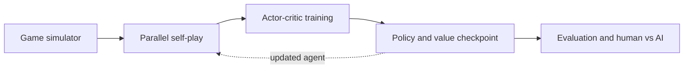

# Architecture

## System at a glance

The same `Game` state machine is used by training, evaluation, tests, and the Windows human-vs-AI interface. This keeps rule fixes from diverging between modes.

Within a game, hidden state is converted into a player-specific 128-element observation. The policy/value network selects among legal masked actions. Parallel games form a rollout batch, the CPU or optional CUDA backend applies an update, and the complete training state is written to an atomic checkpoint.

## Components

| File | Responsibility |
|---|---|
| `src/core.hpp` | Rules, observations, network, actor-critic update, serialization, baseline evaluation |
| `src/fast_train.hpp` | Deterministic multi-thread rollout collection and chunked updates |
| `src/cuda_backend.hpp` | Optional dynamic CUDA/NVRTC backend with CPU fallback |
| `src/windows.cpp` | Win32 desktop interface, training control, evaluation and human play |
| `tests/core_checks.cpp` | Rule, privacy, serialization, corruption and gradient tests |
| `tests/fast_checks.cpp` | Parallel rollout/update and compatibility tests |
| `tests/ui_checks.cpp` | Shared UI transition tests and vector screenshot generation |

## Observation and action spaces

The 128-element observation includes the acting player's hand, both public recruitment piles, discard information, inferred remaining cards, relative position, visible offered card, swap counts, deck size, opponent hand size, and phase. It intentionally excludes the opponent's hand identities, deck order, and face-down offered card.

The policy has 74 outputs: 64 ordered two-card offers, 8 hand-swap actions, and 2 choices during recruitment. Illegal outputs are masked before sampling or greedy selection.

## Checkpoint guarantees

`training.bin` stores weights, champion snapshot, RMSProp statistics, counters, evaluation history, partial gradients, and RNG state. Saves use a temporary file followed by replacement, retain a backup, and validate a checksum on load.
